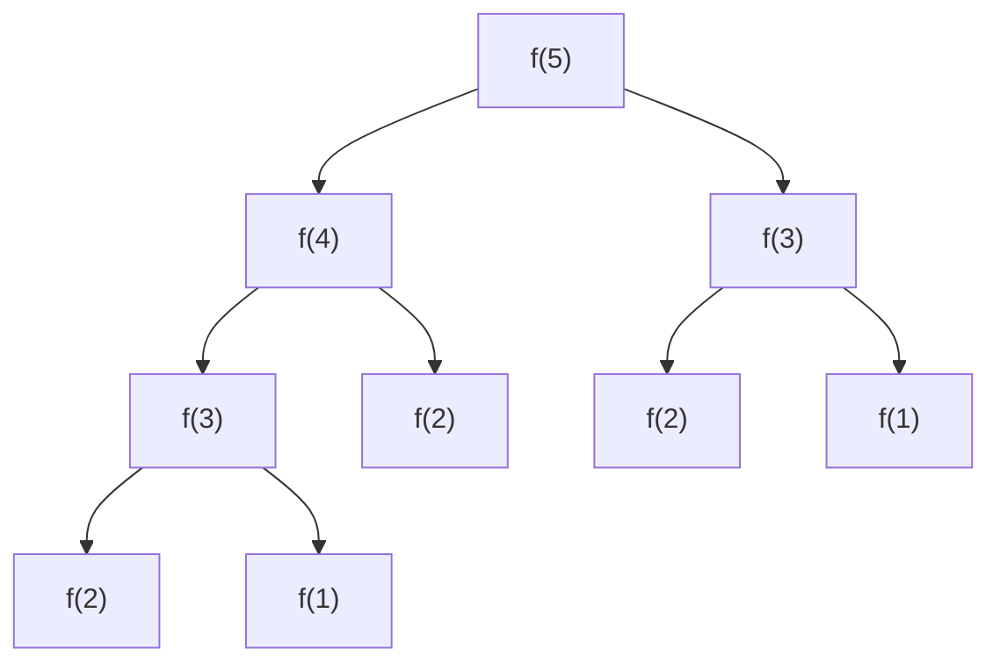

# 动态规划

动态规划的一般形式是求最值，而核心方法是穷举。但动态规划的穷举有点特别，因为这类问题存在`重叠子问题`，如果暴力穷举的话效率会极其低下，所以需要`备忘录`或者`DP table`来优化穷举过程，避免不必要的计算。

动态规划一定具备：

1. `最优子结构，子问题互相独立`，即能够从子规模问题的最优解，得到原问题的最优解
2. `重叠子问题`

最优子结构并不是动态规划独有的一种性质，能求最值的问题大部分都具有这个性质；但反过来，最优子结构性质作为动态规划问题的必要条件，一定是让你求最值的。

## 引入

### 斐波那契

**1. 递归解法**

```cpp
int Fib(n) {
    if (n == 1 || n == 2) {
        return 1;
    }
    return Fib(n - 1) + Fib(n - 2);
}
```

试画`递归树`进行分析：f(5)



从递归树看出，有很多重复计算，即为`重复子问题`，该方法的时间复杂度与该树的规模一样成指数级增长，为 $$O(n^2)$$

尝试优化重复子问题，避免重复计算：

* 备忘录(自顶向下)

```cpp
int helper(int n, vector<int>& memo) {
    // base case
    if (n == 1 || n == 2) {
        return 1;
    }
    if (memo[n] != 0) {
        return memo[n];
    }
    memo[n] = helper(n - 1, memo) + helper(n - 2, memo);
    return memo[n];
}
int fib(n) {
    if (n < 1) {
        return 0;
    }
    // 取 n+1 因为 0 位置没有用到
    vector<int> memo(n + 1, 0);
    return helper(n, memo);
}
```

* DP 数组的迭代(自底向下)

时间复杂度：$$O(n)$$；空间复杂度：$$O(n^2)$$。

```cpp
int fib(n) {
    if (n < 1) {
        return 0;
    }
    vector<int> dp_table(n + 1, 0);
    dp_table[0] = 1;
    dp_table[0] = 1;
    for (int i = 3; i <= n; ++i) {
        dp_table[i] = dp_table[i - 1] + dp_table[i - 2];
    }
    return dp_table[n];
}
```

### 凑零钱

> 给定不同面额的硬币 coins 和一个总金额 amount。编写一个函数来计算可以凑成总金额所需的最少的硬币个数。如果没有任何一种硬币组合能组成总金额，返回 -1。你可以认为每种硬币的数量是无限的。

```cpp
int helper(vector<int>& coins, int amount, unordered_map<int, int>& memo) {
    // 如果这段判断放到 for 循环里面，将起不到作用，且冗余
    if (memo.find(amount) != memo.end()) {
        return memo[amount];
    }
    if (amount < 0) {
        return -1;
    }
    if (amount == 0) {
        return memo[0];
    }
    int MAX = numeric_limits<int>::max();
    int min_ = MAX;
    for (auto coin: coins) {
        int subproblem = helper(coins, amount - coin, memo);
        if (subproblem == -1) {
            continue;
        }
        min_ = std::min(subproblem + 1, min_);
    }
    memo[amount] = min_ != MAX ? min_ : -1;
    return memo[amount];
}

int coinChange(vector<int>& coins, int amount) {
    unordered_map<int, int> memo;
    memo[0] = 0;
    
    return helper(coins, amount, memo);
}
```

采用带备忘录的改进版本，如果采用 vector 存储 amount 的结果将造成存储的稀疏性。故采用 map 存储。

```cpp
int helper(vector<int>& coins, int amount, unordered_map<int, int>& memo) {
    // 如果这段判断放到 for 循环里面，将起不到作用，且冗余
    if (memo.find(amount) != memo.end()) {
        return memo[amount];
    }
    if (amount < 0) {
        return -1;
    }
    if (amount == 0) {
        return memo[0];
    }
    int MAX = numeric_limits<int>::max();
    int min_ = MAX;
    for (auto coin: coins) {
        int subproblem = helper(coins, amount - coin, memo);
        if (subproblem == -1) {
            continue;
        }
        min_ = std::min(subproblem + 1, min_);
    }
    memo[amount] = min_ != MAX ? min_ : -1;
    return memo[amount];
}

int coinChange(vector<int>& coins, int amount) {
    unordered_map<int, int> memo;
    memo[0] = 0;
    
    return helper(coins, amount, memo);
}
```

采用 DP-Table 进行改进，自底向上：

```cpp
int coinChange(vector<int>& coins, int amount) {
    // 也可以将 MAX_INT 赋给初始 dp
    vector<int> dp(amount + 1, amount + 1);
    dp[0] = 0;
    // amount + 1 替代 dp.size() 节省每次计算时间
    for (int i = 1; i < amount + 1; ++i) {
        for (auto coin: coins) {
            if (i - coin < 0) {
                continue;
            }
            dp[i] = std::min(dp[i - coin] + 1, dp[i]);
        }
    }
    return (dp[amount] != amount + 1) ? dp[amount] : -1;
}
```

### 解题框架

以上述`凑零钱`为例说明：

1. 确定 base case，这个很简单，显然目标金额 amount 为 0 时算法返回 0，因为不需要任何硬币就已经凑出目标金额了。
2. 确定「状态」，也就是原问题和子问题中会变化的变量。由于硬币数量无限，硬币的面额也是题目给定的，只有目标金额会不断地向 base case 靠近，所以唯一的「状态」就是目标金额 amount。
3. 确定「选择」，也就是导致「状态」产生变化的行为。目标金额为什么变化呢，因为你在选择硬币，你每选择一枚硬币，就相当于减少了目标金额。所以说所有硬币的面值，就是你的「选择」。
4. 明确 dp 函数/数组的定义。我们这里讲的是自顶向下的解法，所以会有一个递归的 dp 函数，一般来说函数的参数就是状态转移中会变化的量，也就是上面说到的「状态」；函数的返回值就是题目要求我们计算的量。
