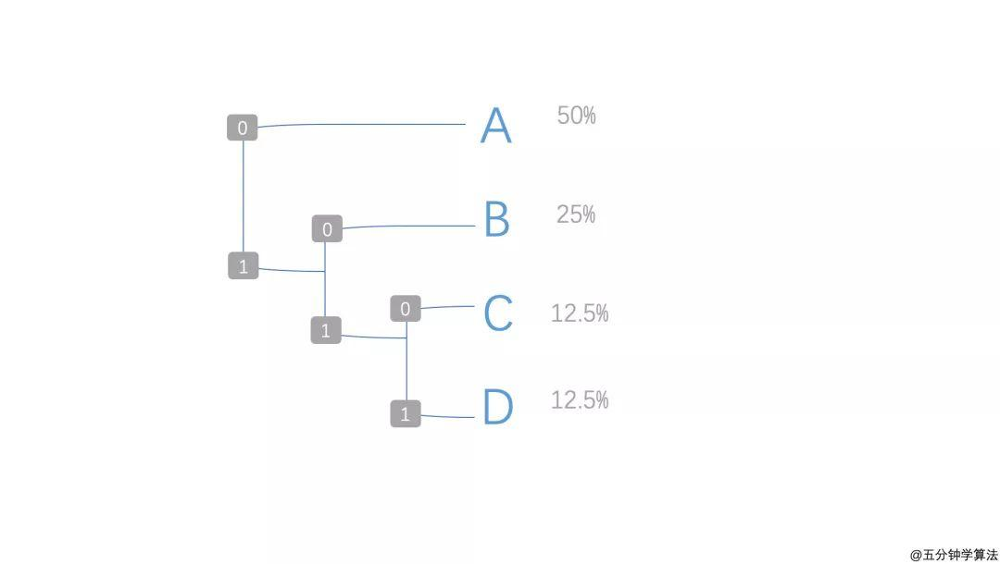

# 霍夫曼编码

一种可变长前缀码，是一普遍的熵编码技术，用于数据的无损压缩。霍夫曼编码使用一种特别的方法为信号源中的每个符号设定二进制码。出现频率更大的符号将获得更短的比特，出现频率更小的符号将被分配更长的比特，以此来提高数据压缩率，提高传输效率。

例如：对于字符串 "ABAABACD"，根据出现频率分配如下：

* 在 A 的情况下，被分配的代码为 0
* 在 B 的情况下，被分配的代码为 10
* 在 C 的情况下，被分配的代码为 110
* 在 D 的情况下，被分配的代码为 111

故该字符串可以表示为："01000100110111"