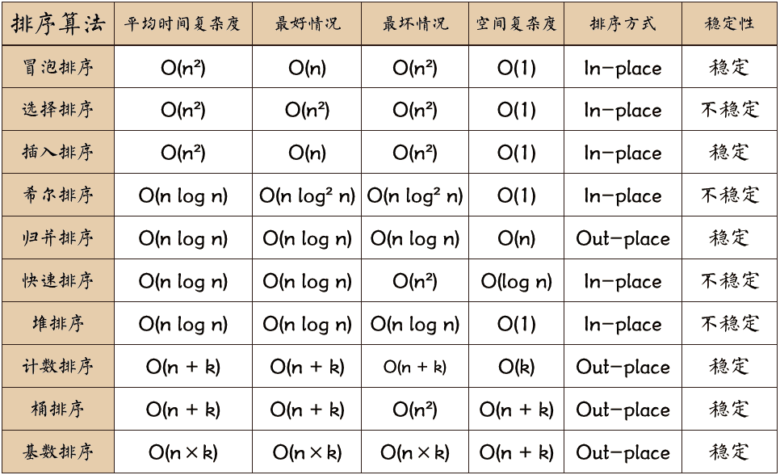

# 十大排序算法

* [参考](https://www.cxyxiaowu.com/2026.html)



## 冒泡排序

时间复杂度为 O(n^2)，空间复杂为 O(1)，in-place，稳定。

```cpp
vector<int>& BubbleSort(vector<int>& arr)
{
    for (int i = 1; i < arr.size(); i++) {
        bool flag = true;
        for (int j = 0; j < arr.size() - i; j++) {
            if (arr[j] > arr[j+1]) {
                int tmp = arr[j];
                arr[j] = arr[j+1];
                arr[j+1] = tmp;

                flag = false;
            }
        }
        if (flag) {
            break;
        }
    }
    return arr;
}
```

## 选择排序

时间复杂度为 O(n^2)，空间复杂为 O(1)，in-place，不稳定。

```cpp
vector<int>& SelectionSort(vector<int>& arr)
{
    for (int i = 0; i < arr.size() - 1; i++) {
        int min_idx = i;
        for (int j = i + 1; j < arr.size(); j++) {
            if (arr[min_idx] > arr[j]) {
                min_idx = j;
            }
        }
        if (i != min_idx) {
            int tmp = arr[i];
            arr[i] = arr[min_idx];
            arr[min_idx] = tmp;
        }
    }
    return arr;
}
```

## 插入排序

时间复杂度为 O(n^2)，空间复杂为 O(1)，in-place，不稳定。

```cpp
vector<int> InsertionSort(vector<int>& arr)
{
    for (int i = 1; i < arr.size(); i++) {
        int index = i;
        int tmp = arr[i];
        while (index > 0 && arr[index-1] > tmp) {
            arr[index] = arr[index-1];
            index--;
        }
        arr[index] = tmp;
    }
    return arr;
}
```

## 归并排序

`python` 版本

```python
class Sort:

    def merge_sort(self, alist):
        if len(alist) <= 1:
            return alist
        
        mid = len(alist) / 2
        left = self.merge_sort(alist[:mid])
        right = self.merge_sort(alist[mid:])
        
        return self.merge(left, right)

    def merge(self, A, B):
        sorted_arr = []
        l = 0
        r = 0
        while l < len(A) and r < len(B):
            if A[l] < B[r]:
                sorted_arr.append(A[l])
                l += 1
            else:
                sorted_arr.append(B[r])
                r += 1
            
        sorted_arr += A[l:]
        sorted_arr += B[r:]

        return sorted_arr
```

`cpp` 版本
```cpp
template <typename T>
class Sort {
public:
    typedef typename std::vector<T>::size_type size_type;
    typedef typename std::vector<T>::iterator iter;

    void MergeSortMain(std::vector<T>& arr)
    {
        if (arr.empty())
            std::cout << "The array is empty" << std::endl;
        else {
            auto first = arr.begin();
            auto last = arr.end();
            MergeSort(arr, first, last);
        }
    }

    void MergeSort(std::vector<T>& arr, iter first, iter last)
    {
        // the recursive return
        if (first + 1 == last) {
            return;
        }
        // the left branch start and end index of iterator
        auto l_first = first;
        // exclude end end iterator
        auto l_last = first + (last - first) / 2;
        MergeSort(arr, l_first, l_last);
        
        auto r_first = l_last;
        // exclude end iterator
        auto r_last = last;
        MergeSort(arr, r_first, r_last);
        // naive in-place
        // SortBiSubArray(arr, l_first, r_first, r_last);
        // not in-place
        NotSortBiSubArray(arr, l_first, r_first, r_last);
    }

    void SortBiSubArray(std::vector<T>& arr, iter first, iter mid, iter last)
    {
        /*
         * in-place
         * exclude the end of iterator
        **/
        iter i = first, j = mid;
        while (i != mid && j != last) {
            if (*i > *j) {
                T tmp = *j;
                for (iter k = mid; k != i; --k)
                    *k = *(k - 1);
                *i = tmp;
                ++i;
                ++mid;
                ++j;
            }
            else {
                ++i;
            }
        }
    }

    void NotSortBiSubArray(std::vector<T>& arr, iter first, iter mid, iter last)
    {
        /*
         * Not in-place
         * */
        std::vector<T> tmp_;
        iter i = first, j = mid;
        while (i != mid && j != last) {
            if (*i > *j) {
                tmp_.push_back(*j);
                ++j;
            }
            else {
                tmp_.push_back(*i);
                ++i;
            }
        }
        if (i == mid) {
            for (; j != last; ++j)
                tmp_.push_back(*j);
        }
        else {
            for (; i != mid; ++i)
                tmp_.push_back(*i);
        }
        for (size_type k = 0; k < tmp_.size() && first != last; k++) {
            *first = tmp_.at(k);
            ++first;
        }
    }
};


// ********* bellow is only merging 
// ********* operator on tow group sorted vector
void inplace_merge_subscript()
{
    /*
     * just test in-place merge
     * index not iterator
     */
    typedef typename std::vector<int>::size_type size_type;

    std::vector<int> v_i{1, 4, 9, 2, 3, 5, 10};
    size_type first = 0, mid = v_i.size() / 2, last = v_i.size() - 1;   
    size_type i = first, j = mid;
    // i index the left part of vector
    // j index the right part of vector
    while (i < mid && j <= last) {
        if (v_i[i] > v_i[j]) {
            int tmp = v_i[j];
            /*
             * CATION: if type is unsigned, be careful that
             *         negative converted to positive when minus
             * */
            for (size_type idx = mid; idx > i; idx--) {
                v_i.at(idx) = v_i.at(idx-1);
            }
            v_i[i] = tmp;
            i++;
            mid++;
            j++;
        }
        else {
            i++;
        }
    }
    
    for (auto &i : v_i)
        std::cout << " " << i;
    std::cout << std::endl;
}

void inplace_merge_iter()
{
    typedef typename std::vector<int>::iterator iter_t;

    std::vector<int> v_i{0, 2, 6, 1, 1, 2, 3, 9};
    iter_t first = v_i.begin();
    iter_t last = v_i.end();
    iter_t mid = first + 3;
    //iter_t mid = first + (last - first) / 2;
    iter_t i = first, j = mid;
    while (i != mid && j != last) {
        if (*i > *j) {
            int tmp = *j;
            for (iter_t k = mid; k != i; --k)
                *k = *(k - 1);
            *i = tmp;
            ++i;
            ++mid;
            ++j;
        }
        else {
            ++i;
        }
    }
    // output the result vector
    for (auto &i : v_i)
        std::cout << " " << i;
    std::cout << std::endl;
}
```


## 快速排序

```python
# out-place 版本
def qsort_out(alist):
    if len(alist) <= 1:
        return alist
    else:
        pivot = alist[0]
        return qsort_in([x for x in alist[1:] if x < pivot]) + \
               [pivot] + \
               qsort_in([x for x in alist[1:] if x >= pivot])

# in-place 版本
# qsort_in(unsortedArray, 0, len(unsortedArray) - 1)
def qsort_in(alist, l, u):
    if l >= u:
        return
    
    m = l
    for i in range(l + 1, u + 1):
        if alist[i] < alist[l]:
            m += 1
            alist[m], alist[i] = alist[i], alist[m]
    alist[m], alist[l] = alist[l], alist[m]
    qsort_in(alist, l, m - 1)
    qsort_in(alist, m + 1, u)
```

`cpp` 版本

```cpp
void Qsort_out(vector<int> &arr, vector<int>& ret)
{
    if (arr.size() <= 0)
        return;

    int pivot = arr[0];
    vector<int> l_arr;
    vector<int> r_arr;

    for (auto i = arr.begin() + 1; i != arr.end(); ++i) {
        if (*i < pivot)
            l_arr.push_back(*i);
        else
            r_arr.push_back(*i);
    }

    Qsort_out(l_sub_arr, ret);
    ret.push_back(pivot);
    Qsort_out(r_sub_arr, ret);
}


void Qsort_in(vector<int> &arr, vector<int>::iterator l, vector<int>::iterator u)
{
    if (l == u)
        return;

    vector<int>::iterator m = l;
    for (auto i = l + 1; i != u; ++i) {
        if (*i < *l) {
            ++m;
            if (m != i) {
                T tmp = *m;
                *m = *i;
                *i = tmp;
            }
        }
    }
    int tmp_ = *l;
    *l = *m;
    *m = tmp_;

    Qsort_in(arr, l, m);
    Qsort_in(arr, m+1, u);
}
```

## 堆排序

```cpp
// max priority queue
class BinaryHeap {
public:
    BinaryHeap() {
        pq_.push_back(0);
    }
    BinaryHeap(vector<int>pq) {
        pq_.push_back(0);
        pq_.insert(pq_.end(), pq.begin(), pq.end());
    }
    
    int size() {
        return pq_.size();
    }
    int max() {
        return pq_[1];
    }
    void exch(int i, int j) {
        std::swap(pq_[i], pq_[j]);
    }
    int parent(int chd) {
        return chd / 2;
    }
    int left(int root) {
        return root * 2;
    }
    int right(int root) {
        return root * 2 + 1;
    }
    
    void swim(int k) {
        while (k > 1 && pq_[parent(k)] < pq_[k]) {
            exch(parent(k), k);
            k = parent(k);
        }
    }
    void sink(int k) {
        while (k < size() / 2) {
            int greater = pq_[left(k)] < pq_[right(k)] ? right(k) : left(k);
            if (pq_[greater] < pq_[k]) {
                break;
            }
            exch(greater, k);
            k = greater;
        }
    }
    void insert(int val) {
        pq_.push_back(val);
        swim(size() - 1);
    }
    int del() {
        int max_ = max();
        exch(1, size() - 1);
        pq_.pop_back();
        sink(1);
        return max_;
    }
    // 如果是删除某个指定 key 呢?

    // 构建 maxheap
    void build() {
        for (int k = (size() - 1) / 2; k >= 1; --k) {
            sink(k);
        }
    }
    void print() {
        for (auto& v : pq_) {
            cout << v << " ";
        }
        cout << endl;
    }

private:
    // 从索引 1 开始存储
    vector<int> pq_;
};
```